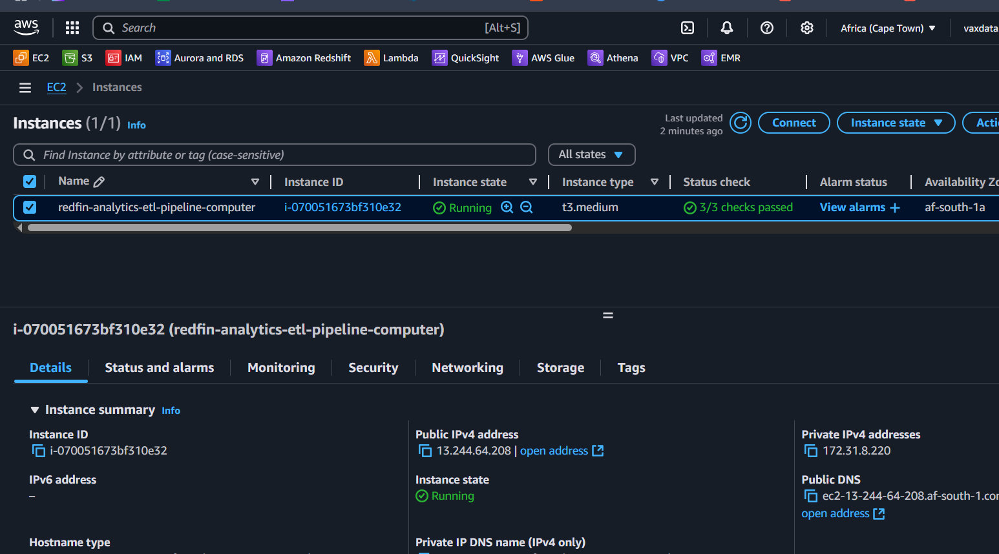
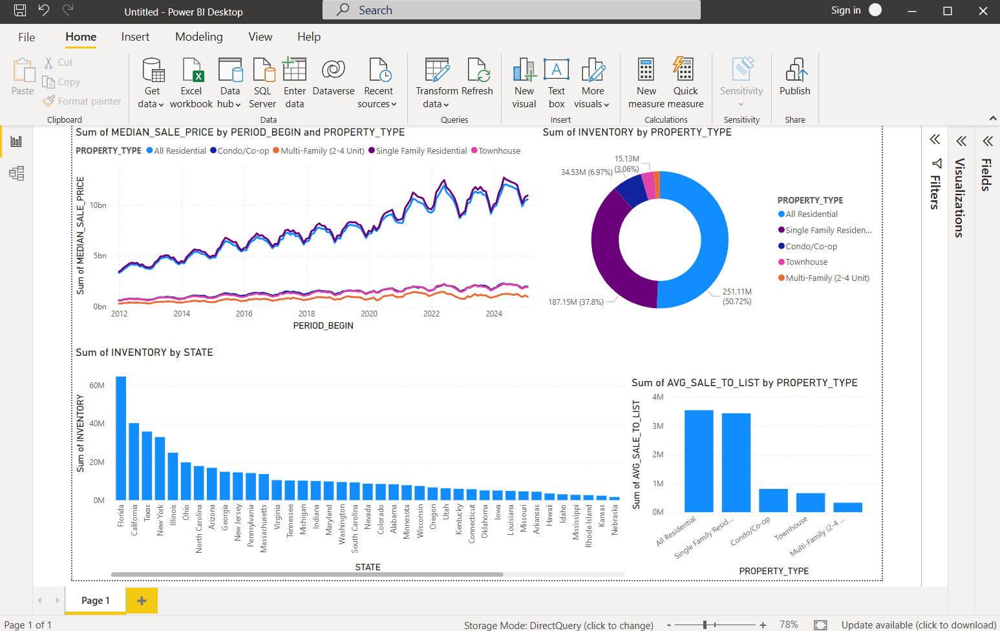

# Redfin Analytics ETL data pipeline using Amazon EMR cluster by Airflow on EC2
This is an end-to-end AWS Cloud ETL project. This data pipeline orchestration uses an Amazon EMR cluster managed by Apache Airflow that is running on an AWS EC2 instance. 
It demonstrates how to build ETL data pipeline that would perform data transformation using Amazon EMR cluster as well as automatic data ingestion into a Snowflake data warehouse via Snowpipe. 
The data would then be visualized using Microsoft Power BI.
<br><br>


<br><br>

## GENERAL OVERVIEW OF PROJECT
This project explains how to use Airflow to automate EMR jobs. It shows how to create EMR cluster, poll the states of the EMR, add EMR steps, and terminate the EMR cluster. 
Airflow was used to orchestrate the entire ETL pipeline.

The EMR steps involved extracting Redfin data from the Redfin datacenter web address and then performed a transformation step on the data. 
Both the raw data and the transformed data were loaded into separate folders of an S3 bucket.

Apache Airflow is an open-source platform used for orchestrating and scheduling workflows of tasks and data pipelines.

The project was inspired by Dr Yemi Olanipekun, whose tutorials benefitted me a lot.
<br><br>

## PROJECT REQUIREMENTS
1. Fundamental knowledge of SQL, Python, CSV/JSON, AWS Cloud, Apache Airflow, DW & ETL concepts
  
2. Familiarity with fundamentals Snowflake DW and S3-Snowpipe data auto-ingestion concepts like SQS Queue
   
3. Redfin real estate City houses dataset (to serve as the source of the real estate data)
 
4. Basic knowledge of Amazon EMR clusters provisioning and PySpark coding/scripting
 
5. AWS EC2 instance with at least 4 GB memory (t3.medium) Ubuntu; and AWS S3 bucket as Data Lake
  
6. Code Editor (I used VSCode) for connecting to EC2 instance to create code (DAG file) on Airflow
  
7. Apache Airflow for orchestration (authoring of the ETL workflow via DAG) & services connections
  
8. Good knowledge and skills in data analytics and visualization on Microsoft Power BI tool
    
9. Perseverance to troubleshoot and resolve errors and failures, read logs, rebuild components, etc
<br><br>

## STEPS OF THE WORKFLOW
The following account of the project development process may not be enough to enable the reader code along or replicate the whole process from start to finish. 
For instance, there is no detailing of the steps involved in creating account with Amazon AWS. 
There is also no detailing of the steps in creating an IAM User whose credentials would be used by Airflow, setting up the S3 buckets, provisioning the Amazon EMR clusters, deploying the Snowpipe along with SQS Queue configuration on the S3 bucket, setting up Snowflake  data warehouse cluster and connecting Power BI to it, spinning up the AWS EC2 instance from scratch and preparing it to work with Airflow (Firewall settings for HTTP/HTTPS/SSH and attaching the IAM Role), connecting VSCode to the EC2 instance, as well as accessing Airflow via web browser.

However a person who is knowledgeable in Data Engineering skills should be familiar with how these are set up. 
By the way the reader who is not knowledgeable in these areas is hereby encouraged to do their own research, enroll in a Data Engineering bootcamp or learn from data engineering tutorials available online on some websites or some great channels on YouTube (such as Tuple Spectra), or reach out to me for clarification. 
With that out of the way, let’s go over the key steps in this project.

Having satisfied all the 9 requirements in the preceding section, I proceeded to carry out the following setup:
<br><br>

### STEP 1: Examining the source data and preliminary coding:
The source data is a real estate data obtained from https://www.redfin.com/news/data-center/.

The particular dataset of interest is the US Housing Market data by “City”, obtained from the following link: 

https://redfin-public-data.s3.us-west-2.amazonaws.com/redfin_market_tracker/city_market_tracker.tsv000.gz

The data is in a compressed format (GZ).

The first part of the development process was done in an online Python-runtime Notebook environment (Google Colab, colab.google) using PySpark in order to examine the source data to see the fields and records. 
This would also serve as a means to code out the data transform function and other preliminary code.


<br><br>

The source dataset originally comprises of 5779946 records and 58 fields.

The data transformation included the following activities:

First, the following 24 columns were selected to be of interest.
```
period_begin,
period_end,
period_duration,
region_type,
region_type_id,
table_id,
is_seasonally_adjusted, 
city, 
state, 
state_code, 
property_type, 
property_type_id,
median_sale_price, 
median_list_price, 
median_ppsf, 
median_list_ppsf, 
homes_sold,
inventory, 
months_of_supply, 
median_dom, 
avg_sale_to_list, 
sold_above_list, 
parent_metro_region_metro_code, 
last_updated
```

Next, as part of data cleaning, these actions were taken on the resulting dataset:
•	Drop all records that have null values. 

•	Typecast the `period_begin` and `period_end` to DATE datatype. 

•	Extract year data from `period_begin_in_years` and `period_end_in_years` into 2 new columns.

•	Extract month data from `period_begin_in_months` and `period_end_in_months` into 2 new columns. 

•	Map the month number to their respective month name.


<br><br>

The transformed dataset was the reported to be 4500063 records and 28 fields. 

See the PySpark Proof-of-Concept (PoC) Python Notebook file [here](codes/Redfin_Analytics_data_transform_PySpark_PoC.ipynb). 
<br><br>

### STEP 2: Created an S3 bucket: `redfin-analytics-emr-etl-bucket`
With the following four (4) folders:
* Raw data folder: `raw-data`
  
* Transformed data folder: `transformed-data`
  
* ETL scripts for EMR: `emr-etl-scripts`
  
* EMR logs: `emr-logs`
  

<br><br>

The data extraction phase would be handled using a Bash script. 

See the script [here](codes/redfin_data_ingest_bash_script.sh).

Based on the logic of the PySpark code PoC developed earlier on, a PySpark script was written to handle the data transformation phase of the ETL process. 

See the script [here](codes/redfin_data_transform_pyspark_script.py).

Both scripts were uploaded to the `emr-etl-scripts` folder of the S3 bucket. 
They would later be referenced by the DAG file.


<br><br>

### STEP 3: Prepared the Snowflake data warehouse environment:
Based on the 28 selected columns for the transformed dataset, the destination table schema was designed using the appropriate data type.
The data warehouse, destination table, staging area, and Snowpipe were then created using a prepared SQL script. 

See the SQL file [here](codes/redfin_analytics_etl_snowflake_dw_create.sql). 

An alternative version of the SQL script is [available](codes/redfin_analytics_etl_snowflake_dw_alternative_create.sql) if it is preferred to have more control over the columns mapping from the transformed data Parquet file to the Snowflake table.


<br><br>

Verified the table schema:

`DESC TABLE redfin_analytics_database.redfin_analytics_schema.redfin_analytics_table;`


<br><br>

Checked the properties of the Pipe created:

`DESC PIPE redfin_analytics_database.snowpipe_schema.redfin_analytics_snowpipe;`


<br><br>

Took note of the `Notification Channel ARN` string.
<br><br>

### STEP 4: S3 bucket configuration for Snowpipe:
First tested the external stage created on Snowflake by uploading a test Parquet file sample of the data to the `transformed-data` folder of the S3 bucket. 

See the file [here](test_data/test-stage-pipe.parquet).


<br><br>


<br><br>

Then this was tested by running the following command on the Snowflake SQL Workspace:

`list @redfin_analytics_database.external_stage_schema.redfin_dw_ext_stage;`


<br><br>

Next, configured the S3 bucket to make it trigger Snowpipe. This was done by creating an Event Notification on the S3 bucket via the bucket `Properties` settings:
* Event name: `redfin-analytics-etl-snowpipe-event`

* Prefix: `transformed-data/`

* Suffix: `.parquet`

* Object creation: `Put`

* Destination: `SQS Queue`

* Specfy SQS Queue (Enter SQS Queue ARN): <<Entered the `Notification Channel ARN` of Snowpipe>>
  

<br><br>

Checked the destination table in Snowflake to see if Snowpipe is working:
```
SELECT *
FROM redfin_analytics_database.redfin_analytics_schema.redfin_analytics_table 
LIMIT 10;
```


<br><br>

```
SELECT COUNT(*) AS Number_Of_Records
FROM redfin_analytics_database.redfin_analytics_schema.redfin_analytics_table;
```


<br><br>

In preparation for the rest of the project, the `transformed-data` folder was emptied and the Snowflake table re-created:


<br><br>


<br><br>

### STEP 5: Created two (2) necessary IAM Roles:
#### Amazon EMR Service Role (EMR Service Role)
•	Trusted entity type: `AWS service`

•	Service: `EMR`

•	Use case: `EMR` 

•	Description: Allows Elastic MapReduce to call AWS services such as EC2 on your behalf.

•	Default permission: `AmazonEMRServicePolicy_v2`

•	Role name: `redfin-analytics-emr-service-role`

•	Other permission(s) attached: `AdministratorAccess`, `AmazonS3FullAccess`


<br><br>

#### EC2 Instance Profile for Amazon EMR (EMR EC2 Service Role)
•	Trusted entity type: `AWS service`

•	Service: `EMR`

•	Use case: `EMR Role for EC2` 

•	Description: Allows EC2 instances in an Elastic MapReduce cluster to call AWS services such as S3 on your behalf.

•	Default permission: `AmazonElasticMapReduceforEC2Role`

•	Role name: `redfin-analytics-emr-ec2-service-role`

•	Other permission(s) attached: `AmazonEC2FullAccess`, `AmazonS3FullAccess`


<br><br>	

### STEP 6: Created a VPC for the EMR cluster
* Name: `redfin-analytics-etl-emr-project`

* Availability zones (AZ): `2`

* Public subnets: `2`

* Private subnets: `0`

* NAT gateways: `None`

* VPC endpoints: `S3 Gateway`
  

<br><br>

VPC subnet to be used as Ec2SubnetId: `subnet-xxxxxxxxxxxxxxxxx`


<br><br>

### STEP 7: Provisioning the EC2 instance that would run Airflow:
* Instance name: `redfin-analytics-etl-pipeline-computer`

* Instance type: t3.medium (in the default Security Group, No IAM Role attached)
  

<br><br>

These required dependencies were then installed on EC2 for this project:
#### Update package list
```
sudo apt update
```
#### Installed the Python environment
```
sudo apt install python3-pip
```
#### Checked the version of Python installed
```
python3 –version
```
#### Installed a Python virtual environment package
```
sudo apt install python3.12-venv
```
#### Install necessary packages that would enable smooth installation of airflow-providers-amazon
```
sudo apt install -y libxml2-dev libxmlsec1-dev libxmlsec1-openssl pkg-config
```
#### Created the virtual environment
```
python3.12 -m venv redfin_analytics_etl_venv
```
#### Activated the virtual environment
```
source redfin_analytics_etl_venv/bin/activate
```
#### Installed Pandas
```
pip install pandas
```
#### Installed Apache Airflow
```
pip install apache-airflow
```
#### Installed Apache Airflow Providers for Amazon
```
pip install apache-airflow-providers-amazon
```
#### To run Airflow in dev mode
```
airflow standalone
```
<br><br>

#### Specifications of the EMR cluster to be created:
* Name: `redfin-analytics-etl-emr-cluster`

* EMR release: `7.8.0`

* Application: `Spark` 

* Primary and Core instances: `m5.xlarge (primary=1, core=3)`

* Cluster termination: `Manually`

* Amazon EMR Service Role (ServiceRole): `redfin-analytics-emr-service-role`

* EC2 Instance Profile for Amazon EMR (JobFlowRole): `redfin-analytics-emr-ec2-service-role`

These specifications would be used in the `JOB_FLOW_OVERRIDES` section of the DAG file. 

The DAG was written to orchestrate the workflow once every month. 

See the finished DAG file [here](codes/redfin_analytics_etl_emr_spark_job_dag.py).


<br><br>
	
#### This orchestration made use of a necessary AWS Airflow connection which was added via the Airflow GUI:
* Connection ID: `aws_new_conn`

* Connection Type: Amazon Web Services

* AWS Access Key: <<THE IAM USER ACCESS KEY>>

* AWS Secret Access Key: <<THE IAM USER SECRET ACCESS KEY>>

* Extra:
    ```
    {	
       "region_name": "af-south-1"
    }
    ```

This connection would also be passed to the `emr_conn_id` parameter of the `EmrCreateJobFlowOperator` function.
<br><br>

The DAG tasks ready to be triggered:


<br><br>

### STEP 8: Preparation before testing the orchestration, and triggering the DAG:
The state of the folders of the S3 bucket and the Snowflake table before triggering the DAG.


<br><br>


<br><br>


<br><br>

#### After triggering the DAG:
The Amazon EMR cluster was observed to be successfully and correctly provisioned by the Airflow DAG.


<br><br>

The data extraction task was a success and it took a little more than 2 minutes to complete.
<br><br>


<br><br>

The extracted raw data was observed inside the `raw-data` folder of the S3 bucket.


<br><br>

The data transformation task was also a success and it took almost 5 minutes to complete.


<br><br>

The transformed data (alongside a `_SUCCESS` marker file) was observed inside the `transformed-data` folder of the S3 bucket.


<br><br>

The Snowflake data warehouse table was also seen to contain the 4.5 million records data.


<br><br>


<br><br>

Thus the entire orchestration was a success and took roughly 13 minutes.
<br><br>


<br><br>


<br><br>


<br><br>

### STEP 9: Connecting Power BI to Snowflake:
* Server: `xxxxxxx-xxxxxxx.snowflakecomputing.com`

* Warehouse: `redfin_analytics_warehouse`

* Username: <MY SNOWFLAKE ACCOUNT USERNAME>

* Password: <MY SNOWFLAKE ACCOUNT PASSWORD>
  

<br><br>

Loaded the data via `DirectQuery`.


<br><br>


<br><br>

#### The visualization dashboard.


<br><br>

## CHALLENGES AND FINAL THOUGHTS
Two (2) challenges were encountered in this project. One was due to insufficient permissions in the EMR service roles that were manually created for the EMR cluster. 
This prevented the orchestration from successfully setting up the EMR cluster. 
However with some research, the optimum level of permissions was provided and the EMR cluster was successfully created at last. 
This would not have been an issue if the EMR service roles were created via AWS CLI as EMR Default Roles since this option would automatically assign the required permissions. 
However I simply wanted to experiment with creating the EMR Service Roles manually in the AWS Console.

The other challenge was due to a failure of Snowpipe to load the transformed data into the destination table in Snowflake. 
This failure was quite troublesome because the real culprit was not easily detected. 
The trouble was due to the fact that Snowpipe was not able to typecast the timestamp data that happened to be in the `period_begin` and `period_end` columns into the `DATE` datatype of the Snowflake table. 
The cause of this problem was that the data transformation code was erroneously written to typecast these columns into `TIMESTAMP` instead of `DATE`.

Moreover the nature of this error that made it to be a real trouble was that in particular, Snowpipe did not say why it failed to ingest the transformed data, but silently ignored the transformed data and skipped loading it into the destination Snowflake table. 
However with some research, I was able to know why by manually triggering the `COPY` command inside Snowflake via SQL Workspace (Snowflake’s SQL Editor environment) using the following SQL command:
```
COPY INTO redfin_analytics_database.redfin_analytics_schema.redfin_analytics_table
FROM @redfin_analytics_database.external_stage_schema.redfin_dw_ext_stage/part-00000-0c334eb9-607d-4bc5-9418-2cf1d5b608d3-c000.snappy.parquet
FILE_FORMAT = (TYPE = PARQUET)
MATCH_BY_COLUMN_NAME = CASE_INSENSITIVE
VALIDATION_MODE = RETURN_ERRORS;
```

This would return any schema or data errors instead of silently skipping. 

After discovering the cause of the problem, I promptly corrected the error in the data transformation PySpark code, and ran the orchestration successfully. The project was really interesting.

I am thankful to Dr. Opeyemi ‘Yemi’ Olanipekun for inspiring me to carry out this project. His passionate way of teaching and guidance is second to none.
<br><br>

## RESOURCES TO LOOK THROUGH
https://www.redfin.com/news/data-center/

https://airflow.apache.org/docs/apache-airflow-providers-amazon/stable/operators/emr/emr.html

https://registry.astronomer.io/providers/amazon/versions/latest/modules/emrjobflowsensor

https://docs.aws.amazon.com/emr/latest/ReleaseGuide/emr-commandrunner.html

https://registry.astronomer.io/providers/amazon/versions/latest/modules/emraddstepsoperator

https://registry.astronomer.io/providers/apache-airflow-providers-amazon/versions/8.4.0/modules/EmrStepSensor
<br><br>

Cover Image credited to Tuple Spectra channel on Youtube.

### Thank you for going through this project with me!


